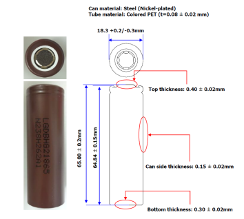
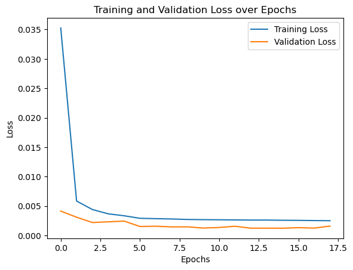
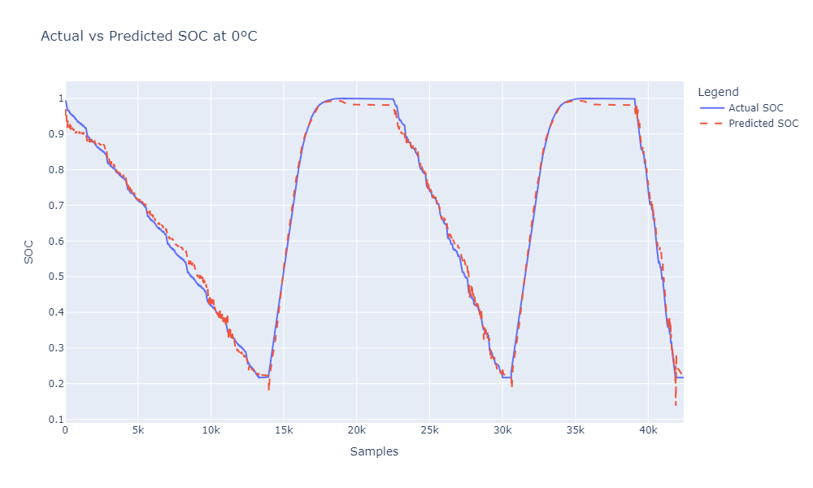
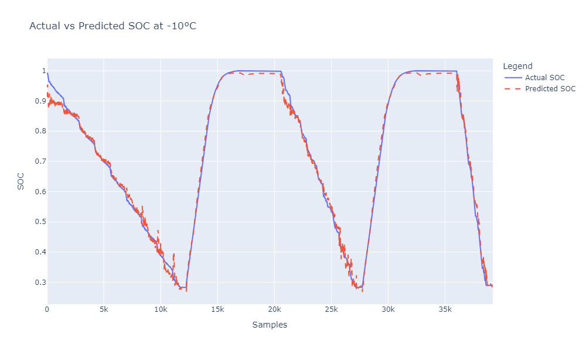
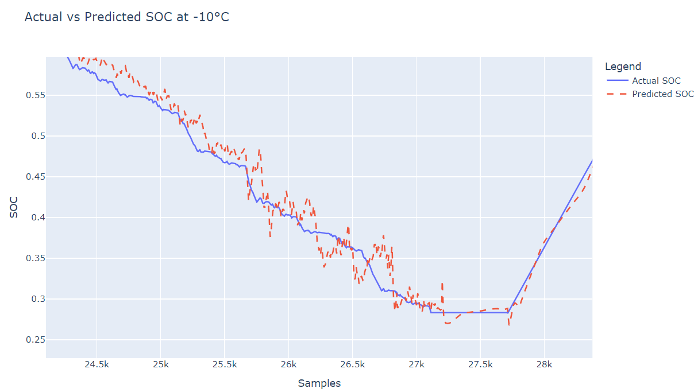
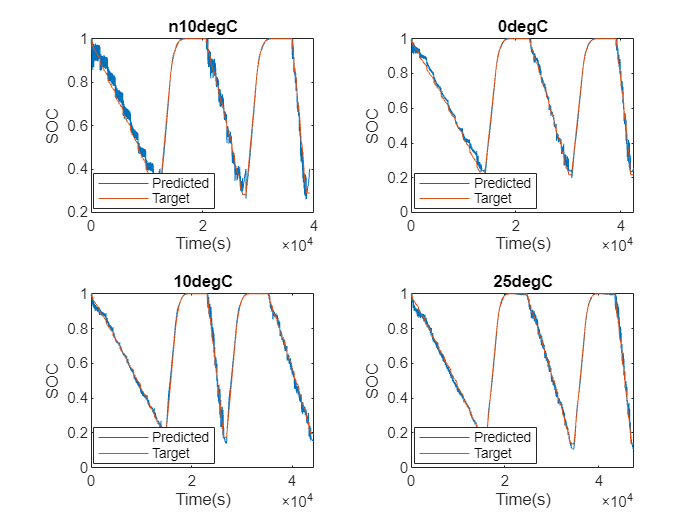
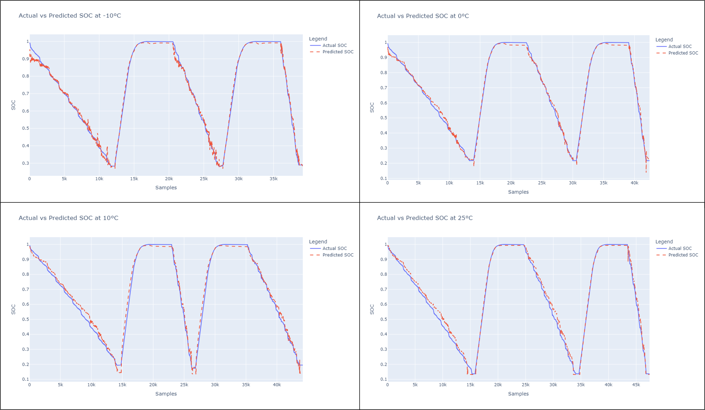
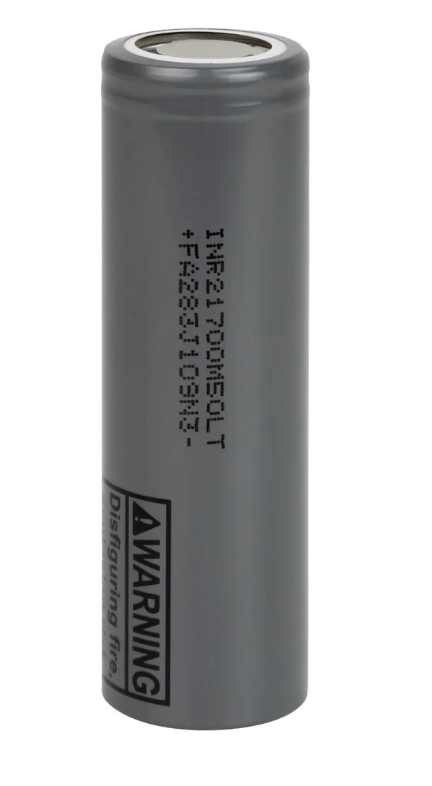
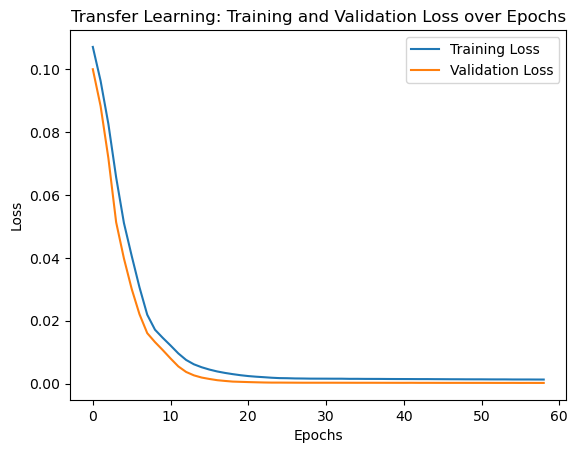
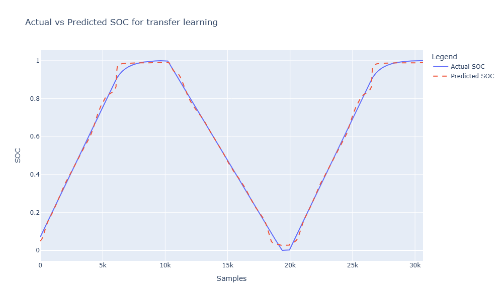

# ⚡ **Advanced SOC Estimation using Transfer Learning**

[](https://www.python.org/)
[](#)
[](#)
[](#)
[](#)

---

This repository provides an advanced approach to **State of Charge (SOC) Estimation** in lithium-ion batteries, employing **Transfer Learning** to adapt a pre-trained model to new battery datasets with different chemistries and operating conditions. The project uses a **Long Short-Term Memory (LSTM)** model to accurately predict SOC by capturing the sequential dependencies in battery data, offering a notable improvement over traditional Feedforward Neural Network (FNN) models.

---

## Table of Contents
- [Project Overview](#project-overview)
- [Why This Project?](#why-this-project)
- [Key Project Tasks](#key-project-tasks)
- [Data Description](#data-description)
  - [Experimental Setup](#experimental-setup)
  - [Tests Included](#tests-included)
  - [Dataset Structure](#dataset-structure)
  - [Data Columns](#data-columns)
- [Requirements](#requirements)
- [Installation](#installation)
- [Usage](#usage)
  - [Training the LSTM Model](#training-the-lstm-model)
  - [Transfer Learning](#transfer-learning)
- [Model Architecture](#model-architecture)
  - [Model Compilation](#model-compilation)
  - [Training Strategy](#training-strategy)
  - [Training Configuration](#training-configuration)
- [Results](#results)
  - [Initial Training Results](#initial-training-results)
  - [Training with Sequence Length 100](#training-with-sequence-length-100)
  - [Temperature-Specific Performance](#temperature-specific-performance)
    - [Insights at 0°C](#insights-at-0c)
    - [Predictions at Other Temperatures](#predictions-at-other-temperatures)
  - [Comparative Analysis: Sequence Lengths](#comparative-analysis-sequence-lengths)
- [Transfer Learning Methodology](#transfer-learning-methodology)
  - [Data and Configuration](#data-and-configuration)
  - [Transfer Learning Model Architecture](#transfer-learning-model-architecture)
  - [Transfer Learning Results](#transfer-learning-results)
  - [Prediction Plot for Transfer Learning](#prediction-plot-for-transfer-learning)
  - [Performance Comparison](#performance-comparison)
- [Extended Results and Conclusions](#extended-results-and-conclusions)
  - [Temperature-Dependent Behavior](#temperature-dependent-behavior)
  - [Recommendations for Improvement](#recommendations-for-improvement)
- [Contributing](#contributing)
- [License](#license)
- [References](#references)

---

## 🔍 Project Overview

The goal of this project is to accurately estimate the State of Charge (SOC) of lithium-ion batteries using cutting-edge machine learning techniques, with a focus on **Transfer Learning**. By leveraging an LSTM model, this project captures the temporal patterns in battery data, improving the model’s predictive accuracy. The project stands out by successfully transferring knowledge from one battery dataset to another, enabling the model to adapt to new battery chemistries and conditions.

### Key Project Tasks
- **Data Preprocessing & Feature Engineering**: Incorporates interaction and temporal features to enhance model adaptability across datasets.
- **LSTM Model Training**: Trains an LSTM model for SOC prediction, improving accuracy by capturing sequential data patterns.
- **Transfer Learning Application**: Fine-tunes the pre-trained LSTM model with data from different battery chemistries and conditions.
- **Comprehensive Evaluation**: Includes SOC prediction performance across various temperatures with detailed metrics (MAE, RMSE, R²) and feature importance analysis.

This approach to SOC estimation offers significant benefits for applications in electric vehicles, energy storage systems, and other areas where accurate SOC estimation is critical.

---

## 🔄 Project Workflow

The workflow for the project is visualized below:


1. **Data Collection**: Collect LG 18650HG2 battery data (voltage, current, temperature, SOC).
2. **Data Preprocessing**: Normalize, add interaction terms, and create temporal features.
3. **Model Training**: Train the LSTM model on initial battery data.
4. **Model Evaluation**: Assess performance metrics (MAE, MSE, R²).
5. **Transfer Learning**: Fine-tune the model using LGM50LT data from PyBAMM simulations.
6. **Final Evaluation**: Compare pre- and post-transfer learning performance.

---

## 📋 Why This Project?

Battery management is essential for safety, longevity, and performance, particularly in EVs and energy storage systems. This project adapts SOC estimation models to new battery chemistries and operating conditions using transfer learning, enhancing model versatility with minimal retraining requirements.

---

## 📊 Data Description

The primary dataset is the **LG 18650HG2 Li-ion Battery Data** provided by Philip Kollmeyer, Carlos Vidal, Mina Naguib, and Michael Skells. 

- **Source**: McMaster University, Ontario, Canada.
- **Publication Date**: March 6, 2020.
- **DOI**: [10.17632/cp3473x7xv.3](https://doi.org/10.17632/cp3473x7xv.3).



### Battery Main Specifications

| Specification         | Value                                             |
|-----------------------|---------------------------------------------------|
| **Chemistry**         | Li[NiMnCo]O2 (H-NMC) / Graphite + SiO             |
| **Nominal Voltage**   | 3.6 V                                             |
| **Charge**            | Normal: 1.5A, 4.2V, 50mA End-Current (CC-CV)      |
| **Discharge**         | 2V End Voltage, 20A MAX Continuous Current        |
| **Nominal Capacity**  | 3.0 Ah                                            |
| **Energy Density**    | 240 (Wh/Kg)                                       |

### Experimental Setup

- A brand new **3Ah LG HG2 cell** was tested with a **75A, 5V Digatron Firing Circuits Universal Battery Tester** in a thermal chamber.
- Tests conducted at multiple temperatures and varied charge-discharge cycles, including **drive cycles** (UDDS, HWFET, LA92, US06).

### Data Structure

The dataset includes both **raw** and **processed** data:
- **Raw Data**: Contains unprocessed voltage, current, temperature, and SOC measurements.
- **Processed Data**: Pre-normalized and cleaned, featuring columns such as voltage, current, temperature, and their rolling averages.

---

## ⚙️ Key Project Tasks

1. **Data Preprocessing**: Normalize, add interaction features, and create temporal features.
2. **Model Training**: LSTM model is trained for SOC estimation, capturing temporal patterns effectively.
3. **Transfer Learning**: Fine-tune the model with PyBAMM-simulated data for new battery chemistry.
4. **Model Evaluation**: Analyze SOC prediction performance across multiple temperatures.
5. **Visualizations**: SOC prediction trends at different temperatures, highlighting accuracy and model adaptability.

This structured approach improves SOC estimation accuracy and adaptability, with potential applications across various battery chemistries and real-world conditions.

### 📈 Data Columns

The processed dataset for training the LSTM model includes the following columns:

- **`Voltage [V]`**: Cell voltage measurement.
- **`Current [A]`**: Measured current in amps.
- **`Temperature [°C]`**: Temperature of the battery.
- **`Voltage Rolling [V]`**: Rolling average of voltage, capturing recent trends.
- **`Current Rolling [A]`**: Rolling average of current, providing smoother current fluctuations.
- **`SOC`**: State of Charge, used as the target variable for model predictions.

These features, after normalization, enhance the model’s capability to detect SOC dynamics. The rolling averages offer insights into time-dependent patterns, which are essential for effective LSTM performance.

---

## 🔧 Requirements

To run this project, ensure the following dependencies are installed:

- `numpy`
- `pandas`
- `matplotlib`
- `tensorflow` (for LSTM model training)
- `pybamm` (for battery simulation)
- `sklearn` (for preprocessing and metrics)

## 🚀 Installation

1. Clone the repository:
   ```bash
   git clone https://github.com/yasirusama61/Advanced-SOC-Estimation-using-Transfer-Learning.git
   cd Advanced-SOC-Estimation-using-Transfer-Learning

2. Install the required dependencies:
   ```bash
   pip install -r requirements.txt

3. Set up your environment (optional, using virtualenv):
   ```bash
   python -m venv venv
   source venv/bin/activate  # Linux/Mac
   venv\Scripts\activate  # Windows

4. Usage:
   - Training the LSTM Model
     To train the LSTM model on battery data:
    - Prepare your dataset and ensure it has the required columns (Voltage, Current, Temperature, SOC).
    - Run the training script:
    ```bash
    python train_lstm.py --data <data/> --epochs 50
  
### 🔄 Transfer Learning
To apply transfer learning, you can fine-tune the pre-trained LSTM model on a new dataset:
- Load the pre-trained model.
- Fine-tune the model:
   ```bash
    python transfer_learning.py --pretrained_model <models/lstm_model.h5> --data <path/dataset>
    
### 🧠 Model Architecture

The LSTM model for SOC estimation includes:

- **Input Layer**: Accepts sequences of time-series data (e.g., voltage, current, temperature).
- **LSTM Layer**:
  - **Units**: 30, capturing temporal dependencies in SOC.
- **Dense Layer 1**:
  - **Units**: 64, **Activation**: ReLU, **Regularization**: L2.
- **Dropout Layer 1**: **Rate**: 0.3.
- **Dense Layer 2**:
  - **Units**: 32, **Activation**: ReLU, **Regularization**: L2.
- **Dropout Layer 2**: **Rate**: 0.3.
- **Output Layer**: **Units**: 1, **Activation**: Sigmoid (scaled for SOC output).

### ⚙️ Model Compilation

- **Loss**: Mean Squared Error (MSE).
- **Optimizer**: Adam with learning rate `0.001`.
- **Metrics**: MSE.

### 📈 Training Strategy

- **Early Stopping**: Monitors validation loss, halting training after 3 epochs without improvement, restoring the best weights.
- **Learning Rate Reduction**: Lowers the rate by 0.2 after 2 stagnant epochs (min rate: `0.0001`).

### 🔧 Training Configuration

- **Epochs**: 50.
- **Batch Size**: 250.
- **Validation Data**: Uses validation sequences (`X_val_seq`, `y_val_seq`).
- **Callbacks**: Early stopping and learning rate adjustment.

## 📊 Results

### Initial Training (Sequence Length 10)

- **MAE**: 0.0107 (average deviation from actual SOC).
- **MSE**: 0.000216 (low prediction error).
- **R²**: 0.997 (explains 99.7% of SOC variance).

### Extended Sequence (Length 100)

- **MAE**: 0.0142 (slight increase with longer sequence).
- **MSE**: 0.0003058 (moderate increase).
- **R²**: 0.9957 (explains 99.57% variance).

### Prediction Stability

Increasing sequence length to 100 reduced fluctuations, especially during charge/discharge cycles, stabilizing SOC predictions over time.

### 📉 Loss Curves

**Training and Validation Loss Over Epochs**:



The loss curves demonstrate a rapid initial decrease, leveling off as training progressed, showing stable convergence.

### Insights from Predictions at Different Temperatures

The model’s SOC prediction performance demonstrates variance across different temperatures, with adjustments like increasing sequence length contributing to improved stability, particularly in challenging conditions.

### 0°C Predictions



- **R² Score**: 0.9957, capturing over 99% of the variance.
- **Reduced Fluctuations**: Increasing the sequence length to 100 significantly minimized fluctuations in discharge regions.
- **Robustness**: Despite the challenges of low temperatures, the model achieves an MAE of 1.42%, effectively managing SOC predictions at 0°C.

### -10°C Predictions



- **Performance Challenges**: At -10°C, noise and fluctuations are more pronounced, especially in discharge cycles.
- **Zoomed View**: The model slightly overreacts to input variations, suggesting potential improvements for smoother predictions under extreme cold.



### 10°C and 25°C Predictions

- **10°C**:
  - **MAE**: 2.24%, **R²**: 0.9891
  - Predicts well, though with slightly higher errors in discharge phases.

- **25°C**:
  - **MAE**: 2.04%, **R²**: 0.9924
  - Stable predictions with minimal fluctuations, showing strong performance in normal conditions.

### Comparative Analysis: Sequence Lengths 10 vs. 100

Increasing sequence length from 10 to 100 resulted in improved prediction stability:

- **Sequence Length 10**: Predictions showed more fluctuations, particularly at lower temperatures.
- **Sequence Length 100**: Provided smoother predictions with better temporal dependency capture, enhancing stability across both charge and discharge cycles.

### Extended Results and Conclusions

#### Model Performance Summary
- The LSTM model performed well across various temperatures, from **-10°C** to **25°C**, with temperature-dependent accuracy, particularly during discharge cycles.

#### Key Observations

1. **Optimal Performance at 25°C**
   - **Accuracy**: At **25°C**, the model achieved its highest accuracy with an **MAE of 2.04%** and an **R² score of 0.9924%**, effectively capturing battery dynamics in stable, moderate conditions.
   - **Smooth Transitions**: Predictions at this temperature displayed minimal noise, indicating the model’s suitability for scenarios with lower thermal volatility.

2. **Challenges at Lower Temperatures (-10°C and 0°C)**
   - **-10°C**: The model struggled with significant noise in discharge predictions, showing an **MAE of 1.27%**. Minor changes in inputs led to amplified fluctuations, particularly during discharge.
   - **0°C**: Slightly better performance than at -10°C, with an **MAE of 1.42%**, though fluctuations were still present.
   - **Explanation**: The model's difficulty at low temperatures likely stems from complex, nonlinear battery behavior, where internal resistance increases and voltage drops more sharply—factors that are challenging for LSTMs to generalize without temperature-specific tuning.

3. **Performance at Intermediate Temperature (10°C)**
   - **Accuracy**: At **10°C**, the model had an **MAE of 2.24%** and an **R² of 0.9891%**. While it captured the general trend, discharge dynamics were harder to predict accurately.
   - **Insights**: Though the model is robust in stable, warmer conditions, performance at intermediate temperatures showed slight degradation, especially in discharge cycles.

In summary, the LSTM model handles stable, moderate temperatures well but may require additional tuning or feature engineering to improve prediction stability at extreme low and intermediate temperatures.

### Temperature-Dependent Behavior:

- **Voltage-SOC Sensitivity**: Battery behavior changes significantly at lower temperatures, making the SOC-to-voltage mapping more nonlinear. This could explain the increased fluctuations at **-10°C** and **+10°C**, where steeper voltage drops during discharge make SOC estimation harder for the model to capture accurately.
  
- **Overfitting to Minor Variations**: At **-10°C**, the model appears to overfit minor variations in sensor data, likely due to increased internal resistance, which adds noise to inputs like voltage and current.

#### Recommendations for Improvement:

1. **Temperature-Specific Feature Engineering**:
   - Include temperature as a model feature to help it better adapt to battery behavior changes across different temperature ranges.

2. **Increase Sequence Length**:
   - Extending the sequence length beyond 100 timesteps could improve the model’s ability to capture long-term trends, especially helpful for nonlinear voltage dynamics in low temperatures.

3. **Regularization**:
   - Enhance regularization (e.g., L2, dropout) to minimize overfitting, especially under low-temperature conditions where data noise is higher.

4. **Data Smoothing**:
   - Apply data smoothing (e.g., rolling averages) on inputs like voltage and current to reduce prediction noise at extreme temperatures.

5. **Ensemble Learning**:
   - Use an ensemble of models trained on different subsets or architectures to average predictions, which could help reduce fluctuations in discharge cycles.

#### Final Conclusion:

The LSTM model performs well at **25°C** and **0°C** but faces challenges at very low temperatures, particularly during discharge at **-10°C**. Adding temperature as a model feature, increasing regularization, and implementing noise reduction could further improve robustness under challenging conditions.

### Comparison of LSTM vs FNN Models

#### Original FNN Results:
- **Prediction Lag**: The FNN model had a notable lag, especially in discharge cycles, and struggled with accuracy at low temperatures (-10°C and 0°C).
- **Difficulty with Transitions**: The FNN struggled with sharp transitions in SOC, resulting in significant errors.

#### LSTM Model Results:
- **Improved Temporal Capture**: The LSTM model tracked SOC transitions more closely, especially in charge/discharge cycles, benefiting from its ability to capture time dependencies.
- **Better Performance Across Temperatures**: LSTM predictions were more accurate across different temperatures, with smoother transitions during dynamic SOC phases.
- **Reduced Deviation at Low Temperatures**: While deviations exist at **-10°C**, they are smaller than those of the FNN model, showcasing the LSTM’s robustness in handling temperature fluctuations.

### Conclusion:
The LSTM model significantly outperforms the FNN model, particularly in capturing temporal dependencies and adapting across various temperatures. This makes it better suited for SOC estimation across different conditions.

#### SOC Prediction Comparisons:




# 🔄 Transfer Learning Results

#### Transfer Learning Data

For transfer learning, simulated data from the **LG M50LT** cell was used to assess the LSTM model's adaptability. While the original dataset came from the **LG 18650HG2** cell, the M50LT has distinct characteristics, including:

- **Chemistry**: Li-ion
- **Capacity**: 5.0 Ah
- **Voltage**: 3.6 V
- **Cell Type**: 21700 (larger form factor than 18650)

Simulating data from the M50LT cell tests the model’s adaptability to different chemistries and performance profiles, critical for real-world applications.

#### Experiment Configuration

Using the **Doyle-Fuller-Newman (DFN) model** in PyBAMM, we configured the following experiment:

1. **Discharge** at 0.4C to 2.5V
2. **Rest** for 10 minutes
3. **Charge** at 0.5C to 4.2V
4. **Hold** at 4.2V until current drops to 50 mA
5. **Rest** for an additional 10 minutes

This setup provides comprehensive SOC dynamics, allowing the model to adapt its predictions to varied cell chemistries and operational conditions, validating the robustness of transfer learning for SOC estimation.



The image above displays the **LG M50LT 21700 Li-ion Battery Cell** along with its dimensions. This cell has a height of 70.15 mm and a diameter of 21.7 mm, with a steel (nickel-plated) can for durability.
#### Experiment Configuration

Using the **Doyle-Fuller-Newman (DFN) model** in PyBAMM, we configured the following experiment:

1. **Discharge** at 0.4C to 2.5V
2. **Rest** for 10 minutes
3. **Charge** at 0.5C to 4.2V
4. **Hold** at 4.2V until current drops to 50 mA
5. **Rest** for an additional 10 minutes

This setup provides comprehensive SOC dynamics, allowing the model to adapt its predictions to varied cell chemistries and operational conditions, validating the robustness of transfer learning for SOC estimation.

# 🔄 **Transfer Learning Data Split and Normalization**

For transfer learning, a **time-based split** was applied to maintain sequence integrity in this time-series dataset:

- **Training Set**: 70% of the data to fine-tune the pre-trained LSTM model
- **Validation Set**: 15% of the data for monitoring validation loss
- **Test Set**: 15% of the data for final evaluation

Each segment was normalized separately with scalers fitted on the training set to prevent data leakage. This time-based split aids the model's adaptation to the new **LG M50LT** battery dataset.

---

### 🧠 **Transfer Learning Model Architecture**

The transfer learning model builds upon a pre-trained LSTM network with adjustments to adapt it to new data:

- **Frozen Layers**: Initial layers from the pre-trained model were frozen, retaining learned features.
- **Transfer-Specific Layers**:
  - **LSTM Layer**: 30 units to capture sequential dependencies.
  - **Dense Layer**: 32 units with ReLU activation.
  - **Dropout Layer**: Rate of 0.3 to reduce overfitting.
  - **Output Layer**: A single unit with sigmoid activation to estimate SOC.

```python
# Transfer Learning Model
transfer_model = Sequential([
    LSTM(30, input_shape=(sequence_length, num_features)),
    Dense(32, activation="relu"),
    Dropout(0.3),
    Dense(1, activation="sigmoid")
])
```
### 🔧 Training and Fine-tuning
The model was compiled with the Mean Squared Error (MSE) loss function, optimized using Adam with a low learning rate of 0.000005 to ensure gradual fine-tuning:

  ```python
     optimizer = Adam(learning_rate=0.000005)
     transfer_model.compile(optimizer=optimizer, loss="mse", metrics=["mse"])
  ```
### 🔧 **Training Configuration**

- **Epochs**: Initially set to 100, with training halted at 59 epochs due to early stopping as validation loss plateaued.
- **Batch Size**: 128
- **Validation Split**: Utilized to track validation loss during training.

#### ⚙️ **Callbacks**

- **EarlyStopping**: Monitored `val_loss` with a patience of 3 epochs to avoid overfitting.
- **ReduceLROnPlateau**: Reduced learning rate by 0.5 if `val_loss` showed no improvement over 2 epochs, with a minimum rate of 1e-6.

---

### 📉 **Training and Validation Loss**

- Achieved a **training loss** of 0.0013 and a **validation loss** of 0.000273 by epoch 59.

#### 📊 **Loss Curve Analysis**


- **Initial Drop**: Rapid loss reduction in early epochs indicates that the model quickly adapted to new data.
- **Stabilization**: Losses began to stabilize around epoch 20, indicating diminishing returns from further training.
- **Convergence**: The model's training and validation losses converged after epoch 30, showing minimal overfitting and effective adaptation to the new battery chemistry.

---

### ⚡ **Feature Engineering for Enhanced Performance**

Initial attempts with core features (**Voltage [V]**, **Current [A]**, **Cell Temperature [C]**, **Avg_voltage**, **Avg_current**) yielded suboptimal results:
- **Mean Absolute Error (MAE):** 0.2305
- **R-squared (R²):** 0.2605

To improve results, the following features were added:

- **Voltage_Current_Interaction**: Helps capture SOC in complex battery cycles.
- **Temp_Current_Interaction**: Critical for SOC prediction under varying load conditions.
- **Temp_Rolling_Avg**: Smooths temperature fluctuations to highlight trends.

**Results After Fine-Tuning:**
- **MAE**: 0.0117
- **R-squared (R²)**: 0.9974
- **RMSE**: 0.0165

This significant improvement underscores the effectiveness of additional features for capturing nuanced relationships.

#### 📈 **Prediction Plot for Transfer Learning**


**Observations:**
- **High Alignment**: Predicted SOC closely matches actual SOC across charge and discharge cycles.
- **Minimal Deviations**: Small deviations are observed only during rapid transitions.
- **Overall Stability**: Minimal oscillations in predicted values, showing robust generalization to new data.

---

## 📊 **Performance Metrics: Before vs. After Transfer Learning**

| Metric                     | 0°C (Before) | -10°C (Before) | 10°C (Before) | 25°C (Before) | After Transfer Learning (25°C) |
|----------------------------|--------------|----------------|---------------|---------------|---------------------------------|
| **MAE**                    | 0.0142       | 0.0157         | 0.0224        | 0.0204        | 0.0117                          |
| **MSE**                    | 0.000315     | 0.000405       | 0.0003229     | 0.0006394     | 0.000273                        |
| **RMSE**                   | 0.0178       | 0.0201         | 0.0180        | 0.0253        | 0.0165                          |
| **R²**                     | 0.9932       | 0.9910         | 0.9891        | 0.9924        | 0.9974                          |

## 🔍 **Improvement with Transfer Learning**

- **MAE Reduction**: 42.6%
- **MSE Reduction**: 57.3%
- **R² Improvement**: 0.5%

These enhancements confirm the model’s improved performance, particularly for stable 25°C conditions, making it highly applicable for precision SOC estimations.

---

## 🤝 **Contributing**

Contributions are welcome! Please open an issue or submit a pull request to help improve this project.

## 📜 **License**

Licensed under the MIT License.

## 📚 **References**

This project utilizes **LG 18650HG2 Li-ion Battery Data**, published by:

- **Philip Kollmeyer**, **Carlos Vidal**, **Mina Naguib**, **Michael Skells**.
- **McMaster University, Ontario, Canada** (DOI: [10.17632/cp3473x7xv.3](https://doi.org/10.17632/cp3473x7xv.3))

If you use this data, please cite as follows:

> Vidal, C., Kollmeyer, P., Naguib, M., & Skells, M. (2020). "Robust xEV Battery SOC Estimator Using Deep Neural Networks," Mendeley Data, DOI: [10.17632/cp3473x7xv.3](https://doi.org/10.17632/cp3473x7xv.3).
