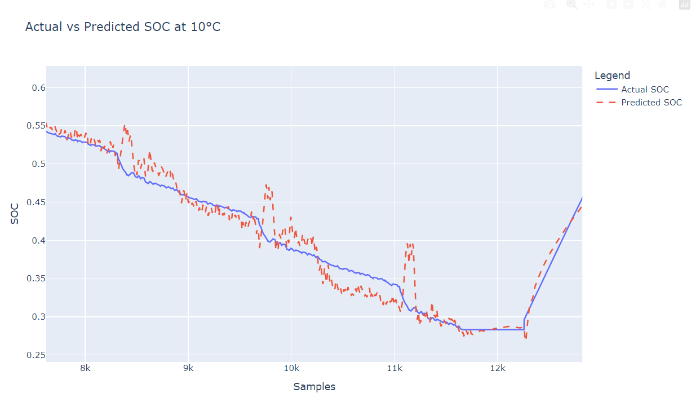
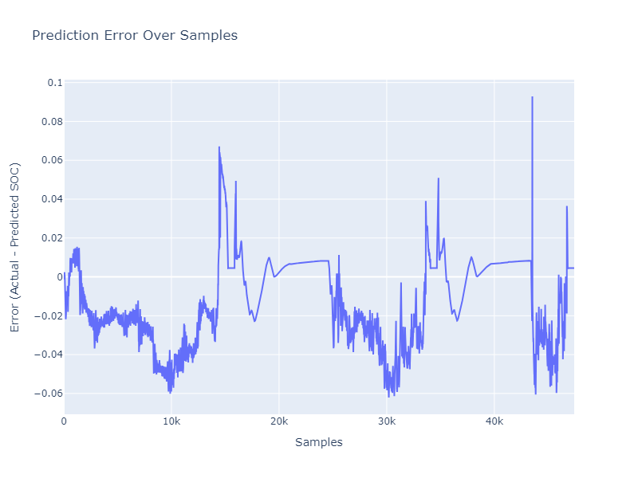
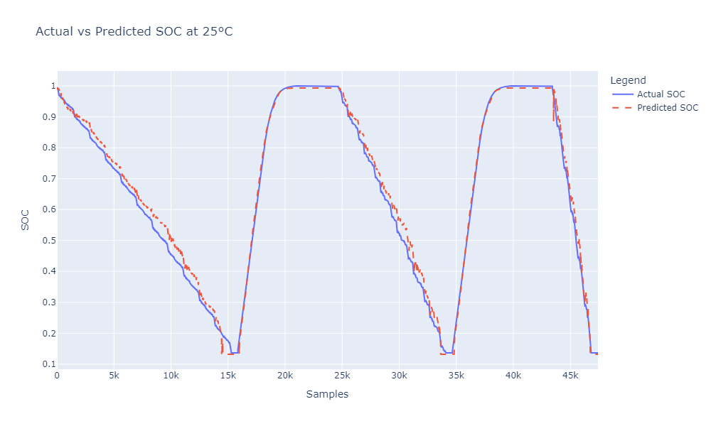
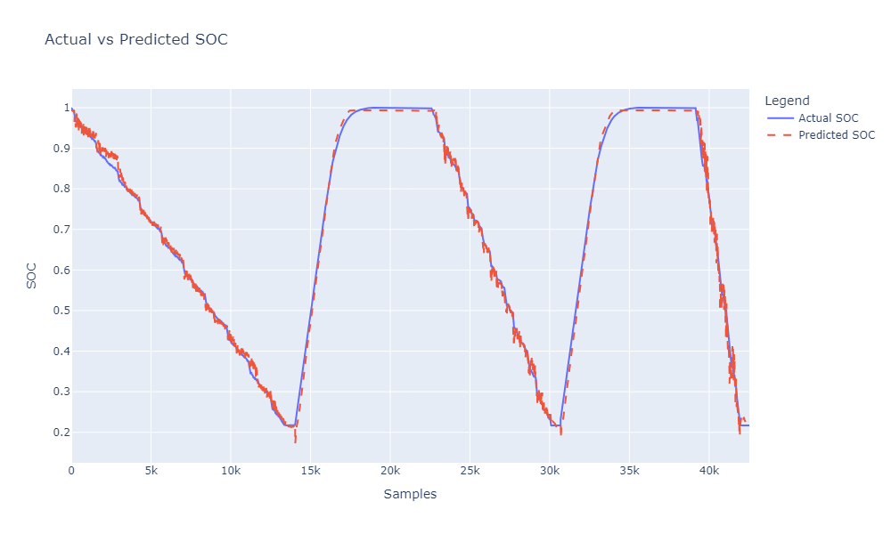
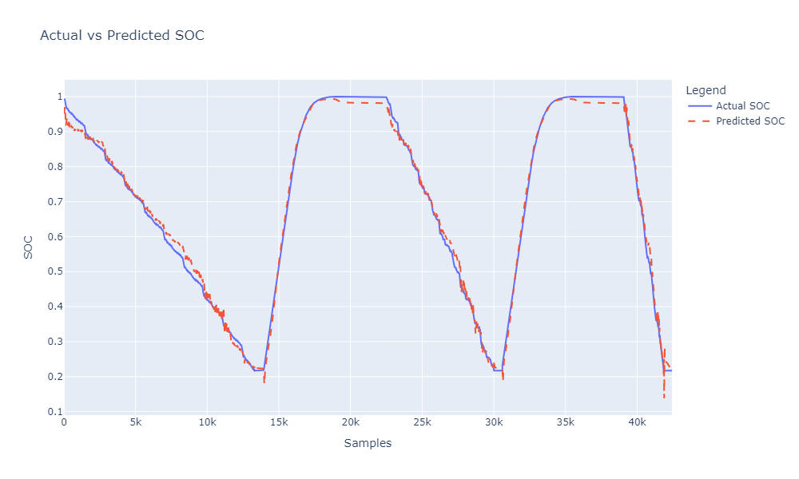

# Advanced SOC Estimation using Transfer Learning

This repository contains the project for **State of Charge (SOC) Estimation** using **Transfer Learning** techniques applied to lithium-ion battery data. The project leverages **LSTM (Long Short-Term Memory)** models to predict SOC, and aims to improve performance using transfer learning across different battery chemistries and operating conditions.

## Table of Contents
- [Project Overview](#project-overview)
- [Data Description](#data-description)
- [Requirements](#requirements)
- [Installation](#installation)
- [Usage](#usage)
- [Model Architecture](#model-architecture)
- [Results](#results)
- [Contributing](#contributing)
- [License](#license)

## Project Overview

The goal of this project is to estimate the SOC of lithium-ion batteries using advanced machine learning techniques, specifically Transfer Learning. This allows us to pre-train a model on one battery dataset and fine-tune it to perform well on new datasets with potentially different chemistries, temperatures, or charge/discharge cycles.

The project consists of the following key tasks:
- Data preprocessing and feature engineering for battery datasets.
- Training an LSTM model for SOC prediction.
- Applying transfer learning for cross-battery predictions.
- Visualization and analysis of model performance.

## Data Description

The dataset used for this project is the **LG 18650HG2 Li-ion Battery Data** provided by:
- **Philip Kollmeyer**, **Carlos Vidal**, **Mina Naguib**, **Michael Skells**.
- Published: 6 March 2020.
- DOI: [10.17632/cp3473x7xv.3](https://doi.org/10.17632/cp3473x7xv.3).

### Experimental Setup

- A brand new **3Ah LG HG2 cell** was tested in an 8 cu.ft. thermal chamber with a **75amp, 5 volt Digatron Firing Circuits Universal Battery Tester**.
- Voltage and current accuracy: **0.1% of full scale**.
- Tests were performed at six different temperatures, with the battery charged at **1C rate** to 4.2V, with a 50mA cut-off.

### Tests Included:
1. **Pulse Discharge HPPC Test**: 1C, 2C, 4C, and 6C discharge tests and 0.5C, 1C, 1.5C, and 2C charge tests.
2. **C/20 Discharge and Charge Test**.
3. **Discharge Tests at 0.5C, 2C, and 1C**: Tests performed before UDDS (Urban Dynamometer Driving Schedule) and Mix3 cycles.
4. **Drive Cycles**: Includes UDDS, HWFET, LA92, and US06 cycles.
5. **Temperature Variations**: Ambient temperatures of 40°C, 25°C, 10°C, 0°C, -10°C, and -20°C. Tests repeated with reduced regeneration current limits for temperatures below 10°C.

### Dataset Structure

The dataset includes both **raw** and **processed** data:
- **Raw Data**: Stored in the folder `LG_HG2_Original_Dataset_McMasterUniversity_Jan_2020`. This data contains unprocessed voltage, current, temperature, and SOC measurements.
- **Processed Data**: Found in `LG_HG2_Prepared_Dataset_McMasterUniversity_Jan_2020`, this data is normalized and contains five columns:
  - Voltage (normalized)
  - Current (normalized)
  - Temperature (normalized)
  - Rolling averages of voltage
  - Rolling averages of current

The processed data has been pre-normalized and cleaned to prepare it for training machine learning models.

### Data Columns:

The processed dataset used for training the LSTM model includes the following columns:

- `Voltage [V]`: Measured cell Voltage.
- `Current [A]`: Measured current in amps.
- `Temperature [°C]`: Temperature.
- `Voltage Rolling [V]`: Rolling average of voltage over a defined window.
- `Current Rolling [A]`: Rolling average of current over a defined window.
- `SOC`: State of Charge, used as the target variable for prediction.

The processed data has been normalized, and these features were engineered to improve the model’s ability to capture the dynamics of SOC over time. The rolling averages of voltage and current help capture the time-dependent trends, providing additional information for the LSTM model.

## Requirements

The project is built using Python, and the following dependencies are required:

- `numpy`
- `pandas`
- `matplotlib`
- `tensorflow` (for building and training the LSTM model)
- `pybamm` (for battery simulation and modeling)
- `sklearn` (for preprocessing and evaluation metrics)

## Installation

1. Clone the repository:
   ```bash
   git clone https://github.com/yasirusama61/Advanced-SOC-Estimation-using-Transfer-Learning.git
   cd Advanced-SOC-Estimation-using-Transfer-Learning

2. Install the required dependencies:
   ```bash
   pip install -r requirements.txt

3. Set up your environment (optional, using virtualenv):
   ```bash
   python -m venv venv
   source venv/bin/activate  # Linux/Mac
   venv\Scripts\activate  # Windows

4. Usage:
   ### Training the LSTM Model
    To train the LSTM model on battery data:
    - Prepare your dataset and ensure it has the required columns (Voltage, Current, Temperature, SOC).
    - Run the training script:
    ```bash
    python train_lstm.py --data <data/> --epochs 50
  
### Transfer Learning
    To apply transfer learning, you can fine-tune the pre-trained LSTM model on a new dataset:
    - Load the pre-trained model.
    - Fine-tune the model:
    ```bash
    python transfer_learning.py --pretrained_model <models/lstm_model.h5> --data <path/dataset>

### Model Architecture

The LSTM model used for SOC estimation consists of the following layers:

- **Input Layer**: The model takes a sequence input with the shape corresponding to the time-series data (voltage, current, temperature, etc.).
- **LSTM Layer**: 
  - **Units**: 30
  - **Purpose**: Captures the temporal dependencies in the SOC data.
- **Dense Layer 1**:
  - **Units**: 64
  - **Activation**: ReLU
  - **Regularization**: L2 regularization (`l2`)
- **Dropout Layer 1**: 
  - **Dropout Rate**: 0.3 (to prevent overfitting)
- **Dense Layer 2**:
  - **Units**: 32
  - **Activation**: ReLU
  - **Regularization**: L2 regularization (`l2`)
- **Dropout Layer 2**:
  - **Dropout Rate**: 0.3
- **Output Layer**:
  - **Units**: 1
  - **Activation**: Sigmoid (for regression output in the range [0, 1])

### Model Compilation

The model is compiled using the following settings:
- **Loss Function**: Mean Squared Error (MSE)
- **Optimizer**: Adam optimizer with a learning rate of `0.001`
- **Metrics**: MSE (Mean Squared Error)

### Training Strategy

The model is trained with early stopping and learning rate reduction strategies:
- **Early Stopping**: Monitors validation loss, stops training if no improvement is observed for 3 consecutive epochs, and restores the best weights.
- **Reduce Learning Rate on Plateau**: Reduces the learning rate by a factor of 0.2 if the validation loss does not improve for 2 epochs. The minimum learning rate is set to `0.0001`.

### Training Configuration

- **Epochs**: 50
- **Batch Size**: 250
- **Validation Data**: Provided validation dataset (`X_val_seq`, `y_val_seq`).
- **Callbacks**: Early stopping and learning rate reduction are used as callbacks.

## Results

### Initial Training (LSTM with Sequence Length 10)

The LSTM model was originally trained on the dataset with a sequence length of 10, and achieved the following results:

- **Mean Absolute Error (MAE)**: 0.0107  
  - This indicates that, on average, the predictions were off by about 0.0107 units from the actual State of Charge (SOC).
  
- **Mean Squared Error (MSE)**: 0.000216  
  - The MSE value reflects that the model has a low prediction error across the dataset.
  
- **R-squared (R²)**: 0.997  
  - This shows that the model can explain 99.7% of the variance in the SOC data.

### LSTM Training with Sequence Length 100

After increasing the sequence length to 100, the model achieved the following metrics:

- **Mean Absolute Error (MAE)**: 0.0142  
  - This indicates that the average error in SOC predictions slightly increased with the longer sequence length.
  
- **Mean Squared Error (MSE)**: 0.0003058  
  - The MSE also slightly increased compared to the initial training.
  
- **R-squared (R²)**: 0.9957  
  - The model still explains 99.57% of the variance in the data, which is a high level of accuracy.

### Reduced Fluctuations in Prediction Plot

By increasing the sequence length from 10 to 100, the LSTM model demonstrated fewer fluctuations in the SOC prediction plot. The predictions have become more stable, particularly during charge and discharge cycles, indicating that the longer sequence helps the model capture more meaningful time dependencies.

### Loss Curves

Below is the plot showing the **Training and Validation Loss over Epochs**:


This plot demonstrates that both training and validation loss decreased significantly in the early epochs and leveled off as training progressed, indicating stable model convergence.

### Insights from the Predictions at 0°C

The following plot compares the **Actual vs Predicted SOC Values at 0 Degree Temperature**:


### Insights from the Predictions at 0°C

The model's performance at **0°C** shows very strong predictive power, with an **R-squared score of 0.9957** after increasing the sequence length. This indicates that over 99% of the variance in the actual SOC values is captured by the model.

- **Fluctuations**: When using a sequence length of 10, the predictions exhibited some fluctuations, especially in the discharge regions. After increasing the sequence length to 100, these fluctuations were significantly reduced, resulting in much smoother predictions.
  
- **Temperature Impact**: At **0°C**, battery behavior can be more volatile due to reduced efficiency and increased internal resistance. The model's ability to handle this challenging condition, especially after the adjustment in sequence length, demonstrates its robustness.

- **Prediction Accuracy**: The **Mean Absolute Error (MAE)** of 0.0142 suggests that, on average, the model’s SOC predictions differ from the actual values by just **1.42%**, which is quite small, especially given the difficult conditions at lower temperatures.


#### Predictions at 10°C
- **Mean Absolute Error (MAE)**: 0.0127  
- **Mean Squared Error (MSE)**: 0.0003229  
- **R-squared (R²)**: 0.9947

### Insights from the Predictions at 0°C and 10°C

- **Performance at 0°C**: The model performed well under the challenging condition of 0°C, with a **Mean Absolute Error** of 1.42%. This demonstrates the model's robustness under low-temperature conditions, which are typically more volatile for batteries.
  
- **Performance at 10°C**: The model performed similarly at 10°C, with a **Mean Absolute Error** of 1.27% and an **R-squared score** of 0.9947. However, upon zooming into the predictions, some fluctuations can still be observed during the discharge cycles.

#### Fluctuations in Predictions at 10°C:
- **Zoomed-In View**: The following plot shows some fluctuations in SOC predictions when zooming in on the discharge region at 10°C:
  
  
  
  These fluctuations suggest that the model may be overreacting to small changes in input signals or may need further adjustments to capture long-term dependencies.

- **Potential Improvements**: 
  - **Increase Sequence Length Further**: Increasing the sequence length beyond 100 (e.g., to 200 or higher) might help smooth out these fluctuations.
  - **Data Smoothing**: Applying more aggressive data smoothing techniques (e.g., higher rolling averages) could help reduce noise in the input data.
  - **Regularization**: Increasing the regularization strength in the Dense layers might prevent overfitting to short-term variations in the data.
  - **Ensemble Methods**: Another approach could involve using ensemble models to average predictions and reduce noise.

#### Predictions at 25°C
- **Mean Absolute Error (MAE)**: 0.0204  
- **Mean Squared Error (MSE)**: 0.0006394  
- **R-squared (R²)**: 0.9924  

### Insights from the Predictions at 25°C

- The model performed reasonably well at **25°C**, achieving a **Mean Absolute Error** of 2.04% and an **R-squared** value of **0.9924**.
  
- **Prediction Fluctuations**: The **Prediction Error Plot** at 25°C shows that while the model performs well in general, some fluctuations exist during SOC estimation, especially during certain charge and discharge cycles.

#### Prediction Error Plot at 25°C

Below is the prediction error plot for the 25°C test:

 

### SOC Predictions at 25°C

Below is the plot showing the **Actual vs Predicted SOC at 25°C**:

 

### Comparative Analysis: Sequence Length 10 vs 100

- **Fluctuations in Predictions**:  
  - With a sequence length of 10, the SOC predictions exhibited more fluctuations, as seen in the plot below:
  
    
  
  - After increasing the sequence length to 100, the fluctuations were significantly reduced, resulting in smoother predictions and more stable performance during both charge and discharge cycles:

    

- **Fluctuations in Predictions**:  
  - With a sequence length of 10, the SOC predictions exhibited more fluctuations, especially in the lower temperatures like 0°C.
  - After increasing the sequence length to 100, the fluctuations were significantly reduced, resulting in smoother predictions across temperatures.

- **Model Stability**:  
  - The longer sequence length of 100 allowed the model to capture more temporal dependencies, leading to fewer oscillations in the predicted SOC values, especially in regions where the SOC remains stable (such as during long charging cycles).

### Transfer Learning Results

Transfer learning was applied to fine-tune the pre-trained LSTM model on a different battery dataset. The transfer learning approach is expected to improve the model's adaptability across different battery chemistries or operating conditions.

The results after applying transfer learning will be updated soon.

- **Mean Absolute Error (MAE)**: *To be added*  
- **R-squared (R²)**: *To be added*  

We expect the transfer learning model to perform well, possibly with similar or improved metrics compared to the initial training, depending on the new dataset's complexity and similarity to the original data.

## Contributing

Contributions to this project are welcome. If you'd like to contribute, please open an issue or submit a pull request.

## License

This project is licensed under the MIT License.

## References

This project uses the **LG 18650HG2 Li-ion Battery Data**, which was collected and made publicly available by:

- **Philip Kollmeyer**, **Carlos Vidal**, **Mina Naguib**, and **Michael Skells**.
- McMaster University, Hamilton, Ontario, Canada.
- Published: 6 March 2020.
- DOI: [10.17632/cp3473x7xv.3](https://doi.org/10.17632/cp3473x7xv.3)

If you use this data for any purpose, please make sure to cite it appropriately as:

> Vidal, C., Kollmeyer, P., Naguib, M., & Skells, M. (2020). Robust xEV Battery State-of-Charge Estimator Design using Deep Neural Networks, Mendeley Data. DOI: [10.17632/cp3473x7xv.3](https://doi.org/10.17632/cp3473x7xv.3)
