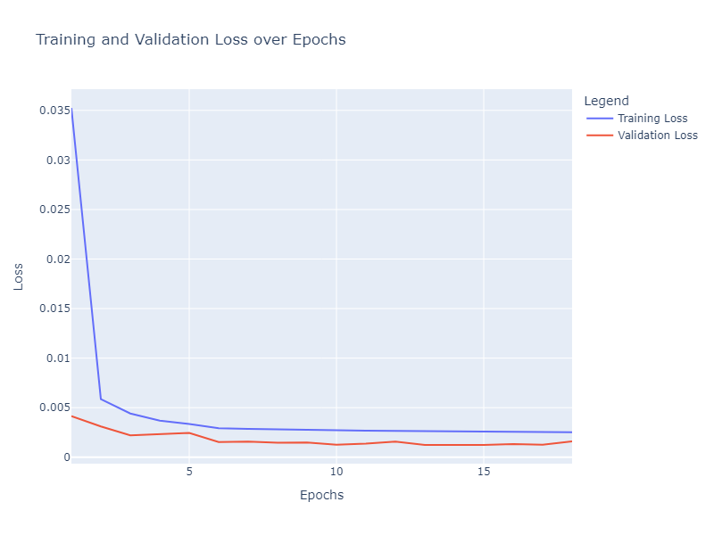

# Advanced SOC Estimation using Transfer Learning

This repository contains the project for **State of Charge (SOC) Estimation** using **Transfer Learning** techniques applied to lithium-ion battery data. The project leverages **LSTM (Long Short-Term Memory)** models to predict SOC, and aims to improve performance using transfer learning across different battery chemistries and operating conditions.

## Table of Contents
- [Project Overview](#project-overview)
- [Data Description](#data-description)
- [Requirements](#requirements)
- [Installation](#installation)
- [Usage](#usage)
- [Model Architecture](#model-architecture)
- [Results](#results)
- [Contributing](#contributing)
- [License](#license)

## Project Overview

The goal of this project is to estimate the State of Charge (SOC) of lithium-ion batteries using advanced machine learning techniques, with a focus on Transfer Learning. While the original data authors employed a Feedforward Neural Network (FNN) model, this project explores the use of a Long Short-Term Memory (LSTM) model for SOC prediction, which has demonstrated improved performance by capturing the sequential dependencies in the battery data.

The project consists of the following key tasks:

- **Data preprocessing and feature engineering** for battery datasets, including interaction features to enhance predictive accuracy.
- **Training an LSTM model** for SOC prediction and comparing it to the original FNN approach.
- **Applying transfer learning** for cross-battery predictions to adapt the LSTM model for different battery datasets with potentially varying chemistries, temperatures, or charge/discharge cycles.
- **Visualization and analysis** of model performance across different temperature profiles and discharge conditions.

## Data Description

The dataset used for this project is the **LG 18650HG2 Li-ion Battery Data** provided by:
- **Philip Kollmeyer**, **Carlos Vidal**, **Mina Naguib**, **Michael Skells**.
- Published: 6 March 2020.
- DOI: [10.17632/cp3473x7xv.3](https://doi.org/10.17632/cp3473x7xv.3).

### Experimental Setup

- A brand new **3Ah LG HG2 cell** was tested in an 8 cu.ft. thermal chamber with a **75amp, 5 volt Digatron Firing Circuits Universal Battery Tester**.
- Voltage and current accuracy: **0.1% of full scale**.
- Tests were performed at six different temperatures, with the battery charged at **1C rate** to 4.2V, with a 50mA cut-off.

### Tests Included:
1. **Pulse Discharge HPPC Test**: 1C, 2C, 4C, and 6C discharge tests and 0.5C, 1C, 1.5C, and 2C charge tests.
2. **C/20 Discharge and Charge Test**.
3. **Discharge Tests at 0.5C, 2C, and 1C**: Tests performed before UDDS (Urban Dynamometer Driving Schedule) and Mix3 cycles.
4. **Drive Cycles**: Includes UDDS, HWFET, LA92, and US06 cycles.
5. **Temperature Variations**: Ambient temperatures of 40°C, 25°C, 10°C, 0°C, -10°C, and -20°C. Tests repeated with reduced regeneration current limits for temperatures below 10°C.

### Dataset Structure

The dataset includes both **raw** and **processed** data:
- **Raw Data**: Stored in the folder `LG_HG2_Original_Dataset_McMasterUniversity_Jan_2020`. This data contains unprocessed voltage, current, temperature, and SOC measurements.
- **Processed Data**: Found in `LG_HG2_Prepared_Dataset_McMasterUniversity_Jan_2020`, this data is normalized and contains five columns:
  - Voltage (normalized)
  - Current (normalized)
  - Temperature (normalized)
  - Rolling averages of voltage
  - Rolling averages of current

The processed data has been pre-normalized and cleaned to prepare it for training machine learning models.

### Data Columns:

The processed dataset used for training the LSTM model includes the following columns:

- `Voltage [V]`: Measured cell Voltage.
- `Current [A]`: Measured current in amps.
- `Temperature [°C]`: Temperature.
- `Voltage Rolling [V]`: Rolling average of voltage over a defined window.
- `Current Rolling [A]`: Rolling average of current over a defined window.
- `SOC`: State of Charge, used as the target variable for prediction.

The processed data has been normalized, and these features were engineered to improve the model’s ability to capture the dynamics of SOC over time. The rolling averages of voltage and current help capture the time-dependent trends, providing additional information for the LSTM model.

## Requirements

The project is built using Python, and the following dependencies are required:

- `numpy`
- `pandas`
- `matplotlib`
- `tensorflow` (for building and training the LSTM model)
- `pybamm` (for battery simulation and modeling)
- `sklearn` (for preprocessing and evaluation metrics)

## Installation

1. Clone the repository:
   ```bash
   git clone https://github.com/yasirusama61/Advanced-SOC-Estimation-using-Transfer-Learning.git
   cd Advanced-SOC-Estimation-using-Transfer-Learning

2. Install the required dependencies:
   ```bash
   pip install -r requirements.txt

3. Set up your environment (optional, using virtualenv):
   ```bash
   python -m venv venv
   source venv/bin/activate  # Linux/Mac
   venv\Scripts\activate  # Windows

4. Usage:
   - Training the LSTM Model
     To train the LSTM model on battery data:
    - Prepare your dataset and ensure it has the required columns (Voltage, Current, Temperature, SOC).
    - Run the training script:
    ```bash
    python train_lstm.py --data <data/> --epochs 50
  
### Transfer Learning
To apply transfer learning, you can fine-tune the pre-trained LSTM model on a new dataset:
- Load the pre-trained model.
- Fine-tune the model:
   ```bash
    python transfer_learning.py --pretrained_model <models/lstm_model.h5> --data <path/dataset>

### Model Architecture

The LSTM model used for SOC estimation consists of the following layers:

- **Input Layer**: The model takes a sequence input with the shape corresponding to the time-series data (voltage, current, temperature, etc.).
- **LSTM Layer**: 
  - **Units**: 30
  - **Purpose**: Captures the temporal dependencies in the SOC data.
- **Dense Layer 1**:
  - **Units**: 64
  - **Activation**: ReLU
  - **Regularization**: L2 regularization (`l2`)
- **Dropout Layer 1**: 
  - **Dropout Rate**: 0.3 (to prevent overfitting)
- **Dense Layer 2**:
  - **Units**: 32
  - **Activation**: ReLU
  - **Regularization**: L2 regularization (`l2`)
- **Dropout Layer 2**:
  - **Dropout Rate**: 0.3
- **Output Layer**:
  - **Units**: 1
  - **Activation**: Sigmoid (for regression output in the range [0, 1])

### Model Compilation

The model is compiled using the following settings:
- **Loss Function**: Mean Squared Error (MSE)
- **Optimizer**: Adam optimizer with a learning rate of `0.001`
- **Metrics**: MSE (Mean Squared Error)

### Training Strategy

The model is trained with early stopping and learning rate reduction strategies:
- **Early Stopping**: Monitors validation loss, stops training if no improvement is observed for 3 consecutive epochs, and restores the best weights.
- **Reduce Learning Rate on Plateau**: Reduces the learning rate by a factor of 0.2 if the validation loss does not improve for 2 epochs. The minimum learning rate is set to `0.0001`.

### Training Configuration

- **Epochs**: 50
- **Batch Size**: 250
- **Validation Data**: Provided validation dataset (`X_val_seq`, `y_val_seq`).
- **Callbacks**: Early stopping and learning rate reduction are used as callbacks.

## Results

### Initial Training (LSTM with Sequence Length 10)

The LSTM model was originally trained on the dataset with a sequence length of 10, and achieved the following results:

- **Mean Absolute Error (MAE)**: 0.0107  
  - This indicates that, on average, the predictions were off by about 0.0107 units from the actual State of Charge (SOC).
  
- **Mean Squared Error (MSE)**: 0.000216  
  - The MSE value reflects that the model has a low prediction error across the dataset.
  
- **R-squared (R²)**: 0.997  
  - This shows that the model can explain 99.7% of the variance in the SOC data.

### LSTM Training with Sequence Length 100

After increasing the sequence length to 100, the model achieved the following metrics:

- **Mean Absolute Error (MAE)**: 0.0142  
  - This indicates that the average error in SOC predictions slightly increased with the longer sequence length.
  
- **Mean Squared Error (MSE)**: 0.0003058  
  - The MSE also slightly increased compared to the initial training.
  
- **R-squared (R²)**: 0.9957  
  - The model still explains 99.57% of the variance in the data, which is a high level of accuracy.

### Reduced Fluctuations in Prediction Plot

By increasing the sequence length from 10 to 100, the LSTM model demonstrated fewer fluctuations in the SOC prediction plot. The predictions have become more stable, particularly during charge and discharge cycles, indicating that the longer sequence helps the model capture more meaningful time dependencies.

### Loss Curves

Below is the plot showing the **Training and Validation Loss over Epochs**:



This plot demonstrates that both training and validation loss decreased significantly in the early epochs and leveled off as training progressed, indicating stable model convergence.

### Insights from the Predictions at 0°C

The following plot compares the **Actual vs Predicted SOC Values at 0 Degree Temperature**:


### Insights from the Predictions at 0°C

The model's performance at **0°C** shows very strong predictive power, with an **R-squared score of 0.9957** after increasing the sequence length. This indicates that over 99% of the variance in the actual SOC values is captured by the model.

- **Fluctuations**: When using a sequence length of 10, the predictions exhibited some fluctuations, especially in the discharge regions. After increasing the sequence length to 100, these fluctuations were significantly reduced, resulting in much smoother predictions.
  
- **Temperature Impact**: At **0°C**, battery behavior can be more volatile due to reduced efficiency and increased internal resistance. The model's ability to handle this challenging condition, especially after the adjustment in sequence length, demonstrates its robustness.

- **Prediction Accuracy**: The **Mean Absolute Error (MAE)** of 0.0142 suggests that, on average, the model’s SOC predictions differ from the actual values by just **1.42%**, which is quite small, especially given the difficult conditions at lower temperatures.


#### Predictions at 10°C
- **Mean Absolute Error (MAE)**: 0.0127  
- **Mean Squared Error (MSE)**: 0.0003229  
- **R-squared (R²)**: 0.9947

### Insights from the Predictions at 0°C, -10°C, 10°C, and 25°C

- **Performance at 0°C**: The model performed well under the challenging condition of 0°C, with a **Mean Absolute Error** of 1.42%. This demonstrates the model's robustness under low-temperature conditions, which are typically more volatile for batteries.

- **Performance at 25°C**: The model achieved a **Mean Absolute Error** of 2.04% at 25°C, with an **R-squared score** of 0.9924%. These results indicate that the model handles normal operating temperatures effectively, though some minor deviations were observed.

- **Performance at +10°C**: The model was tested on **+10°C** data, yielding a **Mean Absolute Error** of 2.24% and an **R-squared score** of 0.9891%. While the model captures the general trend well, the higher error rate suggests that predictions could still benefit from further tuning, particularly in the discharge phases where deviations are more prominent.

#### SOC Predictions at -10°C:
Below is the full plot showing the **Actual vs Predicted SOC at -10°C**:


#### Fluctuations and Noise at -10°C:
- **Significant Noise in Discharge**: Upon closer inspection, the **-10°C** predictions exhibit significant noise, especially in the discharge dynamic patterns. This suggests that the model is having difficulty accurately modeling battery behavior at this extreme low temperature, where the dynamics of the battery change more drastically.

- **Zoomed-In View of Discharge at -10°C**:
  
  
  
  The zoomed-in plot highlights the significant fluctuations observed during the discharge cycle. These fluctuations suggest that the model may be overreacting to small variations in input signals, particularly under harsh conditions like **-10°C**.

#### Full SOC Predictions at +10°C:
Below is the full plot showing the **Actual vs Predicted SOC at +10°C**:


This plot shows the overall performance of the model at **+10°C**. The model generally performs well, though some deviations and fluctuations are visible during the discharge cycle.

#### Comparative Performance and Analysis:

- **0°C vs -10°C**: Comparing the **0°C** and **-10°C** predictions, we observe more significant deviations at **-10°C**, particularly in the discharge dynamics. This indicates that the model may need further refinement to handle the more complex behavior of batteries at very low temperatures.
  
- **25°C Results**: The **25°C** results demonstrate that the model is more stable but some gap between actual and predicting at normal operating temperatures, as expected, with minor noise but overall strong performance.

- **Potential Improvements**: 
  - **Increase Sequence Length Further**: Increasing the sequence length beyond 100 (e.g., to 200 or higher) might help smooth out these fluctuations.
  - **Data Smoothing**: Applying more aggressive data smoothing techniques (e.g., higher rolling averages) could help reduce noise in the input data.
  - **Regularization**: Increasing the regularization strength in the Dense layers might prevent overfitting to short-term variations in the data.
  - **Ensemble Methods**: Another approach could involve using ensemble models to average predictions and reduce noise.

#### Predictions at 25°C
- **Mean Absolute Error (MAE)**: 0.0204  
- **Mean Squared Error (MSE)**: 0.0006394  
- **R-squared (R²)**: 0.9924  

### Insights from the Predictions at 25°C

- The model performed reasonably well at **25°C**, achieving a **Mean Absolute Error** of 2.04% and an **R-squared** value of **0.9924**.
  
- **Prediction Fluctuations**: The **Prediction Error Plot** at 25°C shows that while the model performs well in general, some fluctuations exist during SOC estimation, especially during certain charge and discharge cycles.

#### Prediction Error Plot at 25°C

Below is the prediction error plot for the 25°C test:

 

### SOC Predictions at 25°C

Below is the plot showing the **Actual vs Predicted SOC at 25°C**:

 

### Comparative Analysis: Sequence Length 10 vs 100

- **Fluctuations in Predictions**:  
  - With a sequence length of 10, the SOC predictions exhibited more fluctuations, as seen in the plot below:
  
    
  
  - After increasing the sequence length to 100, the fluctuations were significantly reduced, resulting in smoother predictions and more stable performance during both charge and discharge cycles:

    

- **Fluctuations in Predictions**:  
  - With a sequence length of 10, the SOC predictions exhibited more fluctuations, especially in the lower temperatures like 0°C.
  - After increasing the sequence length to 100, the fluctuations were significantly reduced, resulting in smoother predictions across temperatures.

- **Model Stability**:  
  - The longer sequence length of 100 allowed the model to capture more temporal dependencies, leading to fewer oscillations in the predicted SOC values, especially in regions where the SOC remains stable (such as during long charging cycles).

### Extended Results and Conclusions

#### Model Performance Overview:
- The LSTM model demonstrated strong overall performance across a wide range of operating temperatures, from **-10°C** to **25°C**. However, the model's predictive capability shows temperature-dependent variability, which is particularly evident during discharge cycles.

#### Key Observations:
1. **Consistency at Normal Temperatures (25°C)**:
   - The model showed its best performance at **25°C**, with a **Mean Absolute Error** of 2.04% and an **R-squared score** of 0.9924%. This indicates that the model captures the general battery dynamics well in moderate conditions, which is expected given that most battery behaviors are more stable at room temperature.
   - The predictions at 25°C exhibit smooth transitions with minimal noise, which indicates that the model is well-suited for environments where thermal volatility is minimal.
   
2. **Challenges at Low Temperatures (-10°C and 0°C)**:
   - At **-10°C**, the model faced the most difficulty, exhibiting significant noise in the discharge regions and a **Mean Absolute Error** of 1.27%. The model tends to overreact to minor changes in input signals, leading to large fluctuations, particularly in the SOC predictions during discharge cycles.
   - The performance at **0°C** was slightly better, with a **Mean Absolute Error** of 1.42%, but the model still exhibited fluctuations, albeit to a lesser extent than at -10°C.
   - Low-temperature predictions are challenging due to the complex and nonlinear behavior of batteries under colder conditions, where the internal resistance increases and voltage drops more sharply. These behaviors are harder for the LSTM model to generalize without specific temperature-driven features or adjustments.

3. **Intermediate Temperature Performance (10°C)**:
   - At **+10°C**, the model performed similarly to the lower temperatures, with a **Mean Absolute Error** of 2.24% and an **R-squared score** of 0.9891%. Despite capturing the general trend, the model's performance showed slight deterioration compared to predictions at 25°C.
   - Like the lower temperatures, the model struggled to predict the discharge dynamics as precisely, which indicates that while the model is robust at higher temperatures, intermediate temperatures still exhibit challenges.

#### Temperature-Dependent Behavior:
- **Voltage-SOC Sensitivity**: Batteries exhibit different voltage-SOC behavior at lower temperatures. The SOC-to-voltage mapping becomes more non-linear, and this could explain why the model shows more fluctuation at **-10°C** and **+10°C**. Batteries typically exhibit a steeper voltage drop during discharge at low temperatures, which makes it harder for the model to capture the true state of charge accurately.
- **Overfitting to Minor Variations**: The fluctuations observed, particularly at **-10°C**, suggest that the model may be overfitting to smaller variations in sensor data. This might occur because, at lower temperatures, there is more variability in the input features like voltage and current due to increased internal resistance. This leads the model to overreact to short-term changes instead of focusing on longer-term trends.

#### Recommendations for Improvement:
1. **Temperature-Specific Feature Engineering**:
   - Introduce temperature as a feature in the LSTM model to allow it to better adapt to the varying battery behavior at different temperatures. This will help the model learn different SOC patterns based on the external temperature conditions, improving its adaptability across ranges.
   
2. **Increase Sequence Length**:
   - Increasing the sequence length beyond 100 timesteps would allow the model to capture long-term dependencies in the data. This is particularly important for capturing the non-linear voltage dynamics at lower temperatures and during discharge phases.
   
3. **Regularization**:
   - Add more regularization to the model (e.g., L2 regularization or dropout) to prevent the model from overfitting to minor variations in the data, especially during low-temperature discharge phases.
   
4. **Data Smoothing and Noise Reduction**:
   - Apply smoothing techniques like higher-order rolling averages on input data such as voltage and current to reduce the noise that may be affecting the model's predictions at extreme temperatures.

5. **Ensemble Learning**:
   - An ensemble of models trained on different subsets of the data or using different architectures could help smooth the final predictions by averaging out the errors from each model, potentially reducing the noise in discharge cycles.

#### Final Conclusion:
The LSTM model provides promising results, especially at **25°C** and **0°C**, where it demonstrates strong predictive power. However, it struggles more at extreme low temperatures, particularly during the discharge phases at **-10°C**. With additional feature engineering, such as incorporating temperature as a model input and applying advanced regularization techniques, there is significant potential to further improve the model’s robustness, particularly under challenging conditions like low temperatures.

### Comparison of LSTM Results vs Author's Original FNN Results

### Author's FNN Results:
- **Prediction Lag**: In the original results, the FNN model shows a significant lag in SOC predictions, particularly during discharge cycles. This lag becomes more pronounced at lower temperatures (-10°C and 0°C).
- **Accuracy at Lower Temperatures**: The FNN struggles more at lower temperatures, with deviations becoming larger, especially at -10°C, where the predicted SOC does not follow the target SOC well.
- **Sharp Transitions**: The FNN model has difficulty capturing sharp transitions during the charge and discharge phases, which leads to larger errors during these transitions.

### LSTM Model Results:
- **Better Temporal Capture**: The LSTM model shows much closer tracking of SOC values, especially during transitions between charging and discharging cycles. The LSTM architecture effectively captures the temporal dependencies in the data.
- **Improved Performance Across Temperatures**: The LSTM model maintains better accuracy across all temperature conditions. The prediction lines in the plots follow the actual SOC much more closely, even at extreme temperatures (-10°C and 25°C), which were challenging for the FNN model.
- **Smoother Predictions**: The LSTM model handles transitions more smoothly, especially during sharp changes, resulting in more accurate predictions, particularly during the dynamic SOC phases at varying temperatures.
- **Smaller Deviations at Low Temperatures**: While some deviations still exist, particularly at -10°C, the overall error is smaller than that of the FNN model. This indicates the LSTM’s robustness to temperature fluctuations and the inherent ability to model sequential relationships in the data.

### Conclusion:
The LSTM model significantly outperforms the original FNN model, particularly in areas where the FNN struggled. The LSTM model’s ability to capture time dependencies results in more accurate SOC predictions, especially during sharp transitions and across various temperature profiles. These improvements can be seen clearly in the aligned plot, where the predicted SOC closely follows the actual SOC with fewer deviations.

This demonstrates that the LSTM model is more suited for SOC estimation, providing better accuracy and stability across different temperature conditions than the FNN model used by the original authors.

#### Comparison of SOC Prediction Using FNN vs LSTM Models Across Different Temperature Profiles:


*Cited from author's original results shown above.*


### Transfer Learning Results

Transfer learning was applied to fine-tune the pre-trained LSTM model on a different battery dataset. This approach aims to enhance the model's adaptability across various battery chemistries and operating conditions.
#### Model Architecture

The transfer learning model builds upon a pre-trained LSTM network, with modifications made to adapt it to the new dataset:

- **Pre-trained Layers**: The first layers of the pre-trained LSTM model were frozen to retain the learned representations from the original training dataset. Specifically, all layers except the last three were frozen to balance between retaining learned features and adapting to new data.
- **Custom Transfer Layers**:
  - **LSTM Layer**: A new LSTM layer with 30 units, which processes the sequential data over the specified `sequence_length`.
  - **Dense Layer**: A Dense layer with 32 units and ReLU activation to further capture non-linear relationships in the data.
  - **Dropout Layer**: A Dropout layer with a rate of 0.3 to prevent overfitting by randomly deactivating neurons during training.
  - **Output Layer**: A Dense output layer with a single unit and sigmoid activation, as the task is a regression to estimate SOC within a normalized range.

  ```python
    # Model architecture for transfer learning
    transfer_model = Sequential([
        LSTM(30, input_shape=(sequence_length, num_features)),
        Dense(32, activation="relu"),
        Dropout(0.3),
        Dense(1, activation="sigmoid")
    ])

### Training and Fine-tuning
The model was compiled with the Mean Squared Error (MSE) loss function, optimized using Adam with a low learning rate of 0.000005 to ensure gradual fine-tuning:

  ```python
     optimizer = Adam(learning_rate=0.000005)
     transfer_model.compile(optimizer=optimizer, loss="mse", metrics=["mse"])
  ```
### Training Configuration

- **Epochs**: The model was initially set to train for 100 epochs. However, the early stopping callback halted training at 59 epochs as the validation loss showed no further improvement.

- **Batch Size**: 128

- **Validation Split**: Validation data was used to monitor the model’s performance during training.

#### Callbacks

- **EarlyStopping**: Monitored `val_loss` with patience set to 3 epochs to prevent overfitting.
- **ReduceLROnPlateau**: Reduced learning rate by a factor of 0.5 if `val_loss` did not improve for 2 consecutive epochs, with a minimum learning rate of 1e-6.

### Training Loss and Validation Loss

The model achieved a minimum training loss of 0.0013 and a validation loss of 0.000273 after 59 epochs.

#### Model Loss Curve for Transfer Learning
The training and validation loss curves over epochs during the transfer learning phase are shown below. The curve indicates how well the model was able to minimize error as it adapted to the new data.


### Transfer Learning Loss Curve Analysis

The loss curve for the transfer learning process shows both the training and validation loss decreasing steadily across epochs:

- **Initial Rapid Drop**: In the early epochs, both training and validation loss decrease sharply. This suggests that the model quickly learned useful features from the new dataset and adjusted well to the new battery chemistry and operating conditions.

- **Stabilization Phase**: Around epoch 20, the losses start to stabilize. This indicates that the model has effectively captured the significant patterns in the data, reaching a point where further training provides diminishing returns.

- **Convergence**: The training and validation loss curves converge after epoch 30, suggesting that the model is generalizing well without overfitting. Both losses maintain low values as training progresses, and the early stopping mechanism halts training at epoch 59.

This curve confirms the effectiveness of the transfer learning process, where the model adapts smoothly to new data with minimal overfitting. The achieved low final validation loss validates the improved predictive performance observed in the evaluation metrics.

We initially experimented with a specific set of features, namely **Voltage [V]**, **Current [A]**, **Cell Temperature [C]**, **Avg_voltage**, and **Avg_current**. However, the model's performance on the new dataset was suboptimal with only these five features, showing limited improvement during transfer learning. 

- **Mean Absolute Error (MAE):** 0.2305
- **R-squared (R²):** 0.2605

These initial results showed limitations in the model's ability to accurately capture the SOC dynamics in the new dataset. To address this, we incorporated additional features, specifically:

To address this, we incorporated additional domain-specific features that significantly enhanced model accuracy:

- **Voltage_Current_Interaction**: Captures the interaction between voltage and current, which is especially useful for understanding SOC in complex battery cycles.
- **Temp_Current_Interaction**: Captures the relationship between temperature and current, a critical factor in predicting SOC under varying thermal and load conditions.
- **Temp_Rolling_Avg**: A rolling average of temperature, which helps smooth out sudden temperature fluctuations and allows the model to understand temperature trends over time.

After adding these engineered features, the model's performance improved substantially. Here are the updated results after fine-tuning with transfer learning:

- **Mean Absolute Error (MAE)**: 0.0117
- **R-squared (R²)**: 0.9974

These results show a marked improvement compared to the initial attempt with only the five core features. The additional features allowed the LSTM model to capture more nuanced relationships within the battery data, particularly during dynamic changes in SOC. 


#### Prediction Plot for Transfer Learning
The plot below shows the model's predicted SOC values versus the actual SOC values over a range of samples at various temperature conditions. The close alignment between the predicted and actual values highlights the effectiveness of the transfer learning approach.


##### Key Observations:
- **High Alignment**: The predicted SOC values closely follow the actual SOC values throughout the charge and discharge cycles, showing only minimal deviations. This indicates that the model has effectively captured the complex relationships between features and SOC.
- **Charge and Discharge Cycles**: During both the charge and discharge phases, the predicted values align well with the actual values, especially in the more linear regions. This suggests that the model is well-suited for following the gradual changes in SOC typical of these cycles.
- **Transition Points**: At points of rapid SOC change, such as near the end of charge and discharge, slight deviations are noticeable between the predicted and actual SOC values. These deviations are expected in battery data, especially in highly dynamic regions where changes are more abrupt.
- **Overall Stability**: The plot shows a high degree of stability, with minimal oscillations or noise in the predicted values. This reflects the robustness of the transfer learning approach, where the model has effectively generalized from the pre-trained data to the new dataset.

This level of accuracy, especially around challenging transition points, highlights the effectiveness of transfer learning. The model’s ability to capture SOC dynamics in both steady and rapidly changing phases makes it a valuable tool for applications requiring precise SOC estimations under varying conditions.

## Contributing

Contributions to this project are welcome. If you'd like to contribute, please open an issue or submit a pull request.

## License

This project is licensed under the MIT License.

## References

This project uses the **LG 18650HG2 Li-ion Battery Data**, which was collected and made publicly available by:

- **Philip Kollmeyer**, **Carlos Vidal**, **Mina Naguib**, and **Michael Skells**.
- McMaster University, Hamilton, Ontario, Canada.
- Published: 6 March 2020.
- DOI: [10.17632/cp3473x7xv.3](https://doi.org/10.17632/cp3473x7xv.3)

If you use this data for any purpose, please make sure to cite it appropriately as:

> Vidal, C., Kollmeyer, P., Naguib, M., & Skells, M. (2020). Robust xEV Battery State-of-Charge Estimator Design using Deep Neural Networks, Mendeley Data. DOI: [10.17632/cp3473x7xv.3](https://doi.org/10.17632/cp3473x7xv.3)
